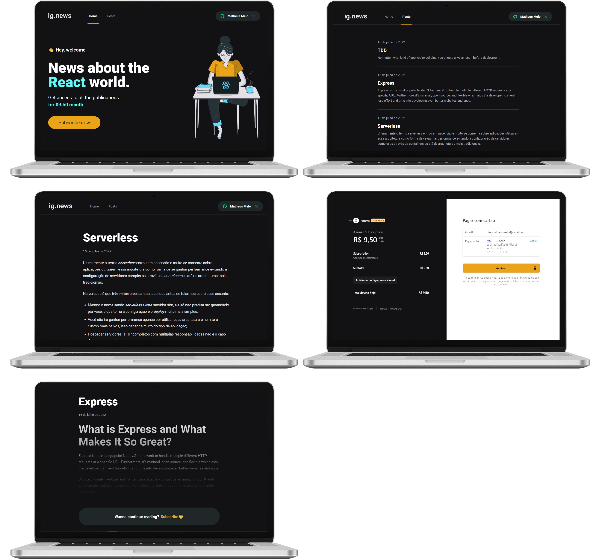

<div align="center">
    
</div>
<p align="center">🚀 React daily news</p>

<div align="center">
 <a href="#-objective">objective</a> •
 <a href="#-roadmap">roadmap</a> •
 <a href="#-technologies">technologies</a> •
 <a href="#-author">author</a>
</div>

---
</br>

>  ### Screens 

</br>

<p align="center">
  
</p>


## 💡 Objective
<p>A site that shows news about React.
The purpose of this project is only for studies on Next.js and payment API`s (Stripe).</p>


## 🎌 Roadmap

### Prerequisites
Before starting, you will need to have the following tools installed on your machine:
<ul>
  <li><a href="https://nodejs.org/en/">Node</a></li>
</ul>

You can also use npm, but we seriously recommend yarn.

Also it's nice to have an editor to work with the code like [VSCode](https://code.visualstudio.com/).

### Running the server


**Execute the commands**

```bash
# Clone this repository
$ git clone https://github.com/mathmelo/Ignews

# Access the project folder in the terminal/cmd
$cd Ignews

# Install dependencies
$ yarn
```
**🚫 Important!!!**

**Before proceeding, you need to do the following steps:**
* Create a document in PismicCMS.
* Put your Prismic API URL in sm.json file (root).
* Create a product (subscription) in STRIPE.
* Create a Github app for social login.
* Create a database in faunadb (tutorial coming soon).
* Create a .env.local file and put all environments (examples in .env.example)

```bash
# Run server
$ yarn dev

# The server will start on port:3000 - go to <http://localhost:3000>
```

## 💜 Technologies
- Typescript
- NextJs
- Next Auth - Social Login
- Prismic CMS
- Stripe
- FaunaDB
- SASS

<br>

---

## 🤓 Author

Informations about [me](https://github.com/mathmelo).
Send me a message! ;)